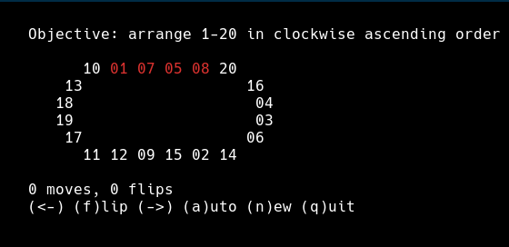

# Ring Puzzle

This project is a small terminal implementation of the 20-bead oval track puzzle, also sold in
physical form as Top Spin by Binary Arts.

The puzzle has 20 numbered beads arranged on a loop. Two legal moves are available:

- rotate the entire loop left or right by one position
- flip the 4-bead window at the front, reversing those four beads in place



The goal is to return the beads to numerical order. In this codebase, a ring is considered solved
up to rotation, so any cyclic ordering of `1, 2, ..., 20` counts as solved.

## Installing and running the game

The recommended way to run the game is with `uvx`, which will automatically set up a virtual environment and install dependencies.  First, install `uv` and `uvx` from:

<https://docs.astral.sh/uv/getting-started/installation/>

Then, execute:

```bash
uvx --refresh --python 3.13 --from "git+https://github.com/yinchi/ring_puzzle.git@v0.0.1" ring
```

Either Python 3.13 or 3.14 will work in the above command.  Replace `v0.0.1` above with the latest version available.

### Controls

- left/right arrow: rotate the ring
- `f`: flip the front 4 beads
- `n`: start a new random puzzle
- `a`: auto-solve the current puzzle, showing each step of the solution
- `q`: quit

The controls will be disabled when the puzzle is solved (except for `n` and `q`), so you can admire your handiwork, and while the auto-solver is running.

## Endgame lookup

The solver uses a greedy algorithm to grow a run of beads until it reaches length at least 16,
then applies an endgame table lookup to determine the sequene of moves that will complete the
solution.  This is stored at `src/ring_puzzle/endgame.json`.  To regenerate this table, run:

```bash
uvx --refresh --python 3.13t --from "git+https://github.com/yinchi/ring_puzzle.git@v0.0.1" endgame
```

Note that multi-threaded Python and at least 128GB of memory is recommended for multi-start bidrectional breadth-first search (one forward-direction search tree for each permutation of the last four beads).  Either Python 3.13t or 3.14t will work in the above command.  Replace `v0.0.1` above with the latest version available.

## Reference

For a mathematical and permutation theory-oriented discussion of the same puzzle family, see Jamie
Mulholland's Oval Track / Top Spin notes:

- https://www.sfu.ca/~jtmulhol/math302/puzzles-ot.html
